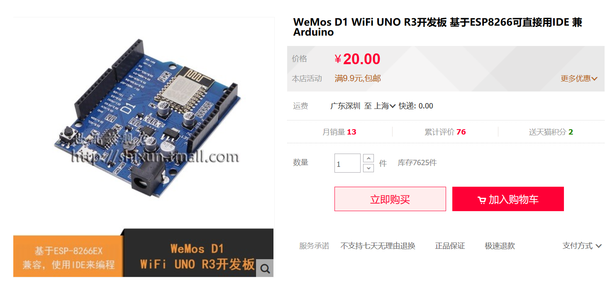
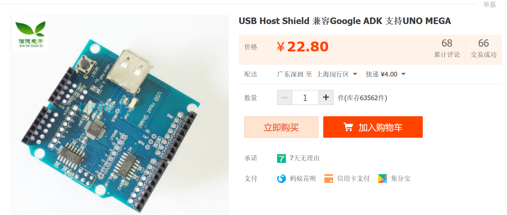
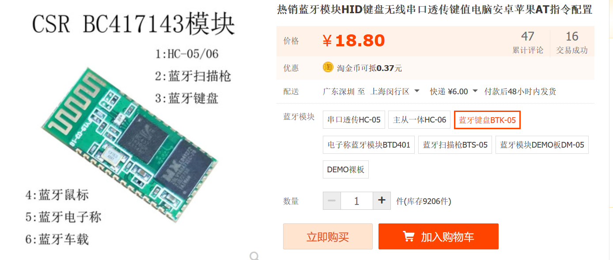
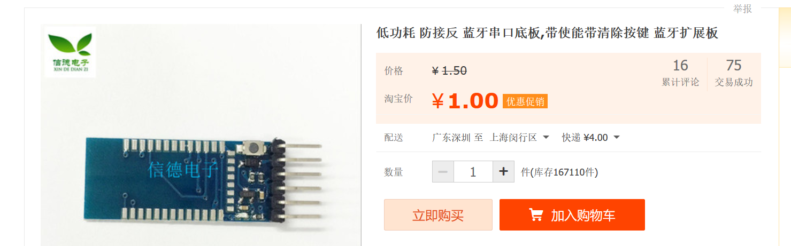
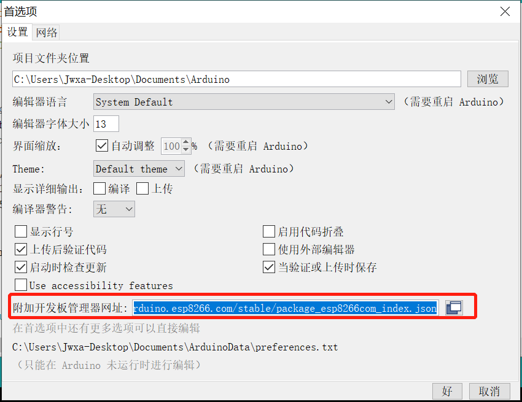
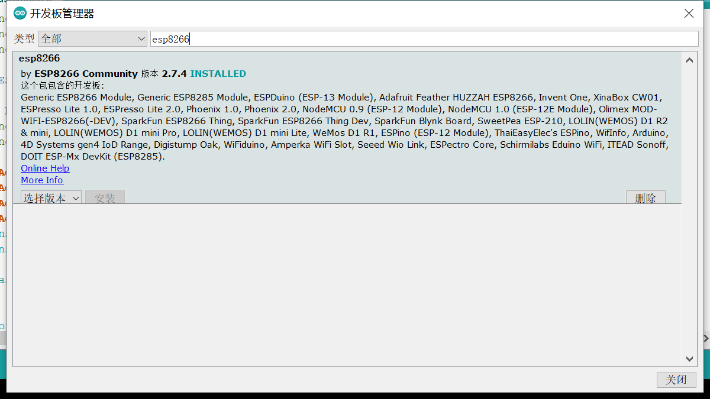
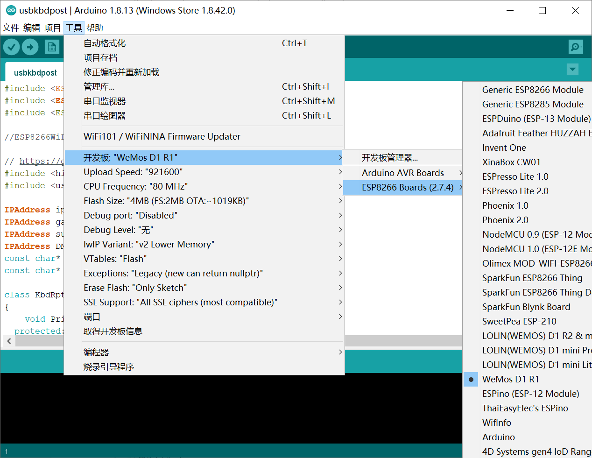
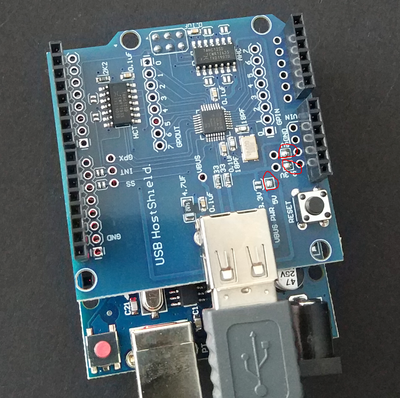
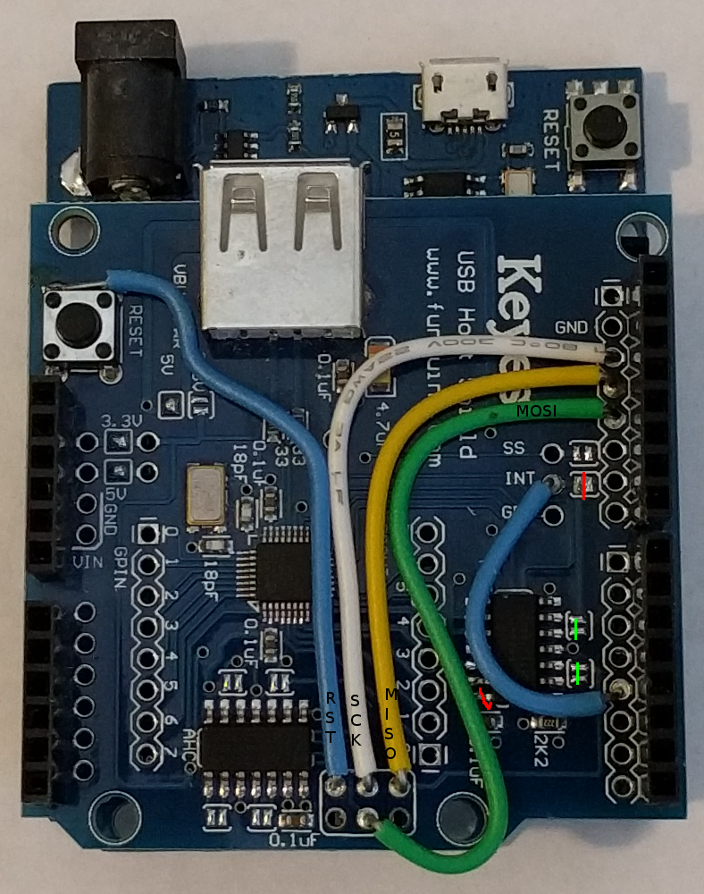
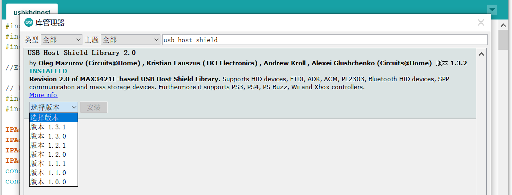

# arduino-usb-host
arduino wemos d1 wifi use usb host 

### 物品列表
1. wemos d1 wifi 开发板

2. usb host shield

3. 蓝牙板



### 通过ARDUINO IDE使用wemos d1
* 文件-首选项- 附加开发板管理器网址填写 https://arduino.esp8266.com/stable/package_esp8266com_index.json


* 工具-开发板-开发板管理器-搜索esp8266


* 选择指定板子


### 修改USB Host Shield 使wemos d1能够使用

* 改造教程 
1. [传送门](https://github.com/gdsports/esp8266-usb-host-demos/wiki/USB-Host-Shield-Modifications)  

2. 备份+补充
* 硬件部分 
i. 烙铁连上（如果是Arduino UNO 这一步之后就直接可以跳到软件部分）  
  
ii. 接线  
```
All of the following are modifications to the USB host shield. The D1 is not modified. Once modified, the shield should not be used with 5V boards such as the Uno and Mega.
Cut the INT trace between the two pads. See the red cut line in the photo. Be sure to verify the two pads are not connected using a multimeter.
Connect INT to GPIO5/SCL/D1. See the short blue wire in the photo.
Remove 2x3 ICSP header. Clear the holes with a solder sucker or solder wick.
Connect GPIO14/SCK/D5 to ICSP-SCK. See the white wire in the photo.
Connect GPIO12/MISO/D6 to ICSP-MISO. See the yellow wire in the photo.
Connect GPIO13/MOSI/D7 to ICSP-MOSI. See the green wire in the photo.
Connect RST to ICSP-RST. Unfortunately, there is no hole next to the RST pin. So ICSP-RST is connected to a pad on the reset button. See the long blue wire in the photo.
To avoid driving the ESP8266 with 5V, disable the voltage level converter (74HCT125) by lifting the power pin. See the red cut mark between the blue and green wires. This is pin 14 (VCC) of the 74HCT125.   这里要用指甲钳钳断
```
 

* 自己的
 

* 软件部分 工具-管理库 -搜索usb host shield
 


### 连接BTK-05蓝牙HID键盘模块
（自行焊接）

* 接线如图（STATE和EN留空），需要注意的是wemos的PIN在代码中的数字是以背面GPIO为准的，比如我这里RX接的2（TX1/D9） TX接的0（D8）
 

### 编码
见代码